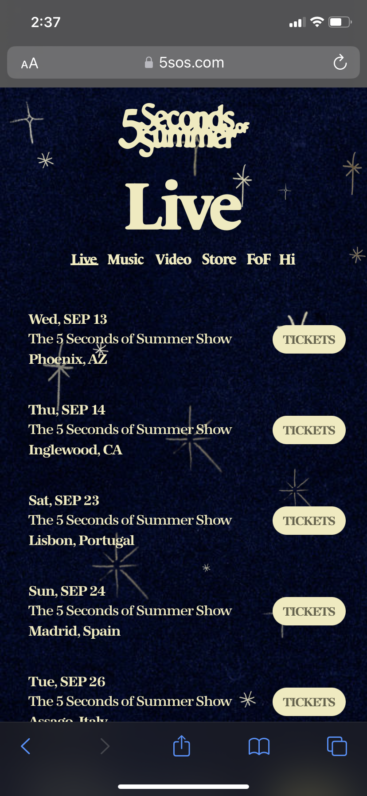
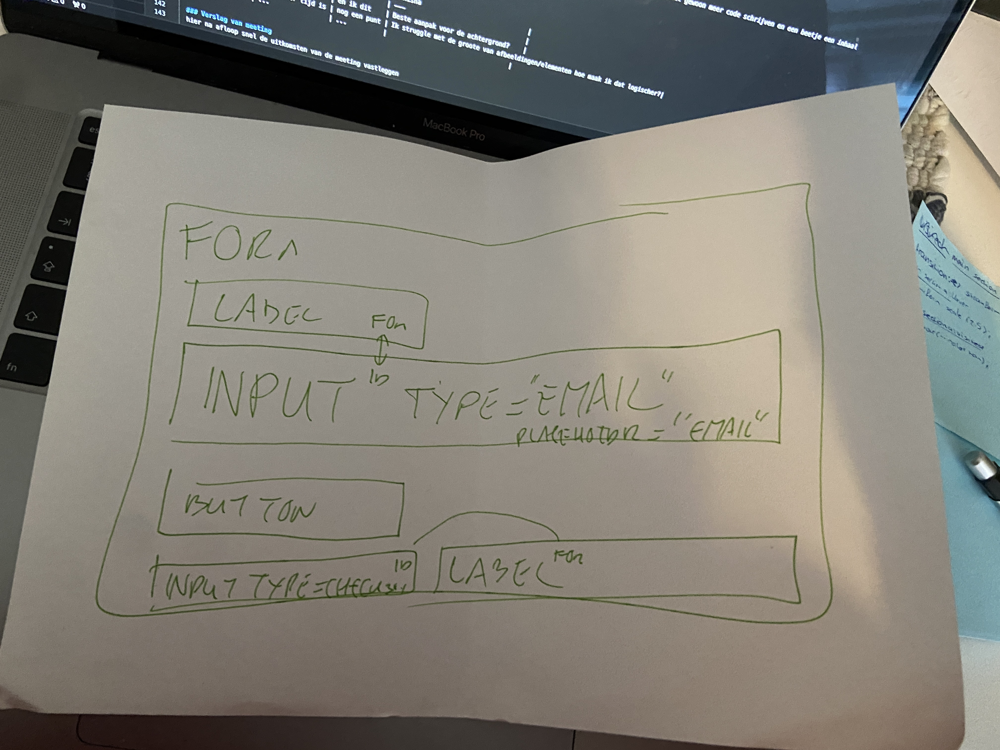
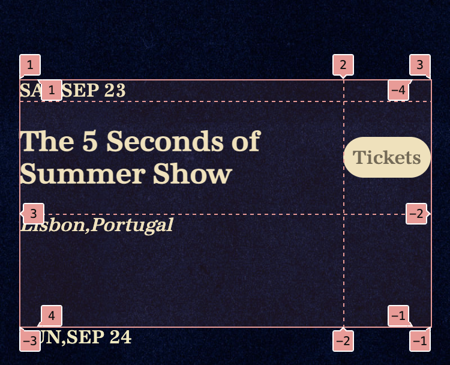
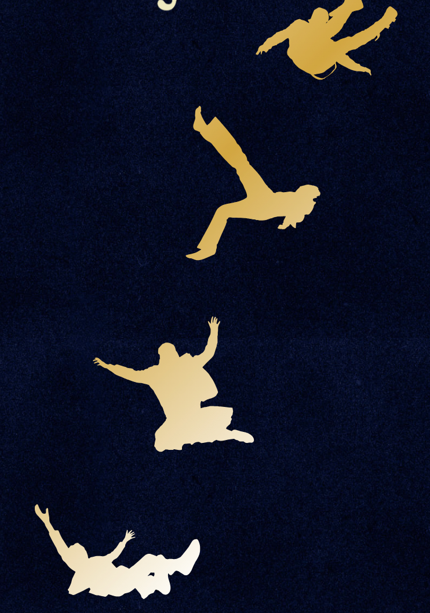

# Procesverslag
Markdown is een simpele manier om HTML te schrijven.  
Markdown cheat cheet: [Hulp bij het schrijven van Markdown](https://github.com/adam-p/markdown-here/wiki/Markdown-Cheatsheet).

Nb. De standaardstructuur en de spartaanse opmaak van de README.md zijn helemaal prima. Het gaat om de inhoud van je procesverslag. Besteedt de tijd voor pracht en praal aan je website.

Nb. Door *open* toe te voegen aan een *details* element kun je deze standaard open zetten. Fijn om dat steeds voor de relevante stuk(ken) te doen.

## Jij

  
uitwerken voor kick-off werkgroep

  ### Auteur:
  Danisha Kreuning

  #### Je startniveau:
  Blauw

  #### Je focus:
  Surface
 

## Je website

  
uitwerken voor kick-off werkgroep

  ### Je opdracht:
  https://5sos.com/ 

  #### Screenshot(s) van de eerste pagina (small screen): 
  hier de naam van de pagina  
  

  #### Screenshot(s) van de tweede pagina (small screen):
  hier de naam van de pagina  
  
 

## Toegankelijkheidstest 1/2 (week 1)

  
uitwerken na test in 2e werkgroep

  ### Bevindingen
  Lijst met je bevindingen die in de test naar voren kwamen:
  De wesbite is eigenlijk totaal niet toegankelijk, er staat nergens een alt tekstje en bij de knoppen staat niet eens aangegven dat het een knop is. Dus het kan eigenlijk alleen maar beter! :) 

  De checklist:
  - 

## Breakdownschets (week 1)

  
uitwerken na afloop 3e werkgroep

  ### de hele pagina: 
  

  ### dynamisch deel (bijv menu): 
  

  ### wellicht nog een dynamisch deel (bijv filter): 
  

## Voortgang 1 (week 2)

  
uitwerken voor 1e voortgang

  ### Stand van zaken
  Opzich ging het niet slecht persoonlijk begrijp ik de flexbox eens stuk beter wat het makkelijker maakte voor mij om te beginnen met de html, uiteraard kwam ik ook een aantal stukken tegen die wat minder gingen maar die heb ik gelaten ipv een uur te schelden naar mijn scherm. De meeste elementen op de site weet ik van wat ik er mee wil/moet maar de hoe is op dit moment lastig voor mij. 

  ### Agenda voor meeting 21-09-2023
  samen met je groepje opstellen

  | Zineb          | Caynalin           | Danisha      
  | ---            | ---                | ---          
  | dit bespreken  | en dit             |   
  | en dat ook nog | dit als er tijd is | Hoe kan ik het beste mijn font toevoegen?
  | ...            | ...                | Hoe kan ik een form toevoegen?
  | ...            | ...                | Hoe kan ik de h1 verbergen?
  | ...            | ...                | Beste aanpak voor de achtergrond?

  ### Verslag van meeting
  hier na afloop snel de uitkomsten van de meeting vastleggen

  - Doormiddel van font face wat ik wel dacht maar kwam er niet helemaal uit 
  - 
  - https://www.a11yproject.com/posts/how-to-hide-content/
  - niet besproken

## Voortgang 2 (week 3)

  
uitwerken voor 2e voortgang

  ### Stand van zaken
  Ben erg ziek geweest waardoor ik niet veel gedaan heb, nu weer begonnen en na wat kleine lastigheden gaat het opzich prima ik moet gewoon meer code schrijven en een beetje een inhaal slag proberen te maken. 

  ### Agenda voor meeting
  samen met je groepje opstellen

  | Zineb          | Caynalin           | Hidde        | Danisha                              |
  | ---            | ---                | ---          | ---                                  |
  | dit bespreken  | en dit             | en ik dit    | Beste aanpak voor de achtergrond?    |
  | en dat ook nog | dit als er tijd is | nog een punt | Ik struggle met de groote van afbeeldingen/elementen hoe maak ik dat logischer?|
  | ...            | ...                | ...          |                                   |

  ### Verslag van meeting
  hier na afloop snel de uitkomsten van de meeting vastleggen

  - Moet gebruik maken van de foto en dan background repeat 
  - kort besproken hoe ik dit het beste kan doen
- ...

## Toegankelijkheidstest 2/2 (week 4)

  
uitwerken na test in 9e werkgroep

  ### Bevindingen
  Lijst met je bevindingen die in de test naar voren kwamen (geef ook aan wat er verbeterd is):

  CONTENT:
  1-YES. de vormgeving is duidelijk
  2-No, het valt opzich mee maar er zou duidelijker gerbuik gemaakt kunnen worden van bijv hover om aan te geven dat je ergens op kan klikken

  GLOBAL CODE:
  1-NO, Verbaasd over het aantal fouten, niet verwacht dat het er zo veel zouden zijn. 
  2-YES
  3-YES
  4-YES

  KEYBOARD:
  1-NO, totaal niet aanwezig alleen in de nav 
  2-NO, totaal niet aanwezig alleen in de nav

  MOBILE AND TOUCH:
  1-NO,
  2-NO,
  3-NO,
  4-YES,

  HEADINGS:
  1-NO,
  2-NO,
  3-NO,
  4-NO,

  LISTS:
  1-YES

  IMAGES:
  1-NO,
  2-NO,
  3-NO,
  4-NO,

MEDIA:
NIET AANWEZIG

CONTROLS:
1-YES
2-NO,
3-YES
4-NO,
5-NO,
6-YES

APPEARANCE:
1-NO,
2-YES
3-YES
4-NO,

ANIMATION:
1-NO,
2-NO,
3-NO,

COLOR CONTRAST:
1-YES
2-YES
3-YES
4-YES
5-YES

## Voortgang 3 (week 4)

  
uitwerken voor 3e voortgang

  ### Stand van zaken
Ih heb helaas sinds afgelopen dinsdag geen tijd gwehad om aan fed te zitten of vragen te formuleren. Ik hoop dat dit nog lukt voor de les. En anders kan ik misschien leren van de anderen.

  ### Agenda voor meeting
  samen met je groepje opstellen

  | student 1      | student 2          | student 3    | student 4        |
  | ---            | ---                | ---          | ---              |
  | dit bespreken  | en dit             | en ik dit    | en dan ik dat    |
  | en dat ook nog | dit als er tijd is | nog een punt | dit wil ik zeker |
  | ...            | ...                | ...          | ...              |

  ### Verslag van meeting
  hier na afloop snel de uitkomsten van de meeting vastleggen

  - punt 1
  - punt 2
  - nog een punt
  - ...

## Eindgesprek (week 5)

  
uitwerken voor eindgesprek

  ### Je uitkomst - karakteristiek screenshots:
  
  

  ### Dit ging goed/Heb ik geleerd: 
  Ik heb best wel veel geleerd maar ik ben vooral trots op de grid van de live pagina omdat ik die eigenlijk volledig zelf in elkaar gezet heb!

  

  Ook ben ik erg blij met de 'poppetjes' op de homepagina ik had verwacht dat dit een stuk moeilijker zou zijn maar dat bleek minder moeilijk dan ik dacht. 

  

  ### Dit was lastig/Is niet gelukt:
  De echte website heeft een soort animatie sterren die flikkeren maar dit heb ik achterwege gelaten omdat ik hier geen tijd meer voor had.

  

## Bronnenlijst

  
continu bijhouden terwijl je werkt

  Nb. Wees specifiek ('css-tricks' als bron is bijv. niet specifiek genoeg). 
  Nb. ChatGpT en andere AI horen er ook bij.
  Nb. Vermeld de bronnen ook in je code.

  1. https://www.a11yproject.com/posts/how-to-hide-content/
  2. Sanne
  3. De DLO slides over grid 
  4. De DLO slides over animatie

